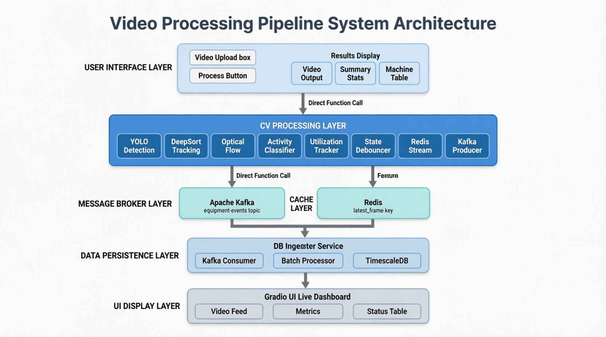
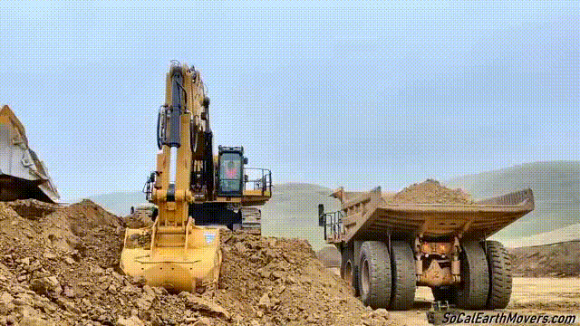

# Construction Equipment Utilization Tracker

A real-time, microservices-based computer vision pipeline that monitors construction equipment,

 classifies work activities, and streams live utilization analytics to a dashboard UI.

---

## 📌 Overview

Eagle Vision processes video feeds of construction sites to answer one question: **is this machine actually working?**

The system detects and tracks equipment (excavators, dump trucks, etc.), distinguishes between **ACTIVE** and **INACTIVE** states — even when only part of the machine is moving — classifies specific work activities, calculates utilization percentages, and streams everything through Kafka to a live dashboard.

**NOTE**: *This is an Technical Assessment Task for EagleVision Company
*
---

## 🏗️ Architecture



---

## ✨ Features

### Component A — Computer Vision

| Feature | Description |
|---|---|
| **Equipment Detection** | YOLOv12n fine-tuned to detect excavators, dump trucks, and other construction equipment |
| **Multi-Object Tracking** | DeepSORT maintains persistent Track IDs across frames |
| **Articulated Motion Detection** | Region-based Optical Flow detects movement in specific machine parts (e.g., excavator arm digging while tracks are stationary) |
| **State Classification** | Classifies each tracked machine as `ACTIVE` or `INACTIVE` per frame |
| **Activity Classification** | Detects: `Digging`, `Swinging/Loading`, `Dumping`, `Waiting` |
| **Utilization Calculation** | Computes `Total Active Time / Total Tracked Time` per machine |
| **Data Streaming** | Publishes structured JSON payloads to Kafka → ingested into TimescaleDB |

### Component B — Analytics Backend & UI

- Live processed video feed with bounding boxes and state labels
- Per-machine status panel (ACTIVE / INACTIVE + current activity)
- Utilization dashboard: Total Working Time, Total Idle Time, Utilization %
- Built with **Gradio** for real-time streaming support

---

## 🗂️ Project Structure

```
├── docker-compose.yml
├── images
│   ├── latest_frame.jpg
│   ├── output_prototype_model.gif
│   └── output_v12m.gif
├── init.sql
├── inputs
│   ├── 2_test.mp4
├── LICENSE
├── models
│   ├── prototype_model.pt
│   └── yolo12m_tuned.pt
├── notebooks
│   ├── 1.prototype_Yolo12n.ipynb
│   └── 2.yolov12m_Tune.ipynb
├── outputs
│   ├── all_predictions.csv
│   ├── all_predictions.json
│   └── latest_frame.jpg
├── README.md
├── services
│   ├── cv_engine
│   │   ├── activity_classifier.py
│   │   ├── denseflow.py
│   │   ├── Dockerfile
│   │   ├── helpers.py
│   │   ├── main.py
│   │   ├── object_tracker.py
│   │   |__ requirements.txt
│   ├── db_service
│   │   ├── db_ingester.py
│   │   ├── Dockerfile
│   │   └── requirements.txt
│   └── kafka_service
│       ├── kafka_engine.py
├── tests
│   ├── consumer.py
│   ├── kafka_test.py
│   └── producer.py
├── tools
│   └── video_spliter.py
└── ui
    ├── app.py
    ├── Dockerfile
    └── requirements.txt
```

---

## 📦 Kafka Payload Format

The CV microservice publishes the following JSON payload per frame per tracked machine:

```json
[
    {
      "track_id": 1,
      "session_id": "0a776122",
      "timestamp": 1775585939.36,
      "frame": 6,
      "class_name": "Excavator",
      "state": "INACTIVE",
      "activity": "Waiting",
      "confidence": 0.282,
      "bbox": {
        "x1": 628,
        "y1": 58,
        "x2": 1123,
        "y2": 506
      },
      "utilization": {
        "total_active_sec": 0.0,
        "total_inactive_sec": 0.0,
        "total_tracked_sec": 0.0,
        "utilization_pct": 0.0
      },}]
```

---

## 🛠️ Tech Stack

| Layer | Technology |
|---|---|
| Detection & Tracking | YOLOv12n (fine-tuned) + DeepSORT |
| Motion Analysis | OpenCV Optical Flow (region-based) |
| Message Broker | Apache Kafka |
| Time-Series DB | TimescaleDB (PostgreSQL extension) |
| UI | Gradio |
| Containerization | Docker + Docker Compose |
| Language | Python |

---


## 🧠 Key Design Decisions

### Why Optical Flow over LSTM or 3D CNN?

The main challenge was detecting an **ACTIVE** state when only part of the machine moves (e.g., excavator arm). Several approaches were considered:

| Approach | Speed | Data Needed | Chosen? |
|---|---|---|---|
| Rule-based Optical Flow | ✅ Fast | None | ✅ Yes |
| LSTM (feature time-series) | ⚠️ Medium | Large labeled set | ❌ No |
| Instance Segmentation | ⚠️ Medium | Moderate | ❌ No |
| 3D CNN / Video Transformer | ❌ Slow | Large | ❌ No |

For a real-time deployment with no pre-labeled activity data, region-based Optical Flow was the most practical choice.

### Why YOLOv12n over YOLOv12m?

After training YOLOv12m for 30 epochs and testing in production:
- Slower inference — not suitable for real-time
- Higher GPU memory requirements
- Marginal accuracy gain over the nano variant

The fine-tuned `yolov12n` model offered the best speed/accuracy balance for this use case.

#### Comparison between 2 models:
- **Yolo12n**:

     
- **Yolo12m**:

    

### Why Gradio over Streamlit?

Streamlit's re-run model caused flickering and lag on the live video feed. Gradio's streaming interface handled real-time frame updates more gracefully.

---

## ⚠️ Known Issues & Limitations

- Optical Flow performance degrades in low-light or high-occlusion scenes
- The consumer will creaet the Kafka topic if it's not exist `KAFKA_AUTO_CREATE_TOPICS_ENABLE: true`
- Activity classification is rule-based — may misclassify edge-case movements

---


## 🙏 Acknowledgements

- [Eng Ahmed Ibrahim For the Technical Assessment Task](https://www.linkedin.com/in/ahmed-ibrahim-93b49b190)
- [Kaggle Construction Equipment Dataset](https://www.kaggle.com/datasets/xyzyxzzxy/construction-equipment)
- [Mobile Crane Monitoring with CV — Medium](https://medium.com/@wongsirikuln/mobile-crane-usage-monitoring-with-cv-8ee2af623bf2)
- Ultralytics YOLO
- DeepSORT authors

--------------------------------

# Log

- 7 apr 2026: we still solving some issues in `db_ingester` , the consumer we create stop if there is no data to get from kafka “it wait for a 1s before stopping”. but we need it to still running waiting for new data
    - edit the UI for now it’s accept for use video input
    - now, everything is working…..
    - Made all resources public Create `README.md`and submitted LinkedIn Post
- 6 apr 2026: we solve some typo issues in our streamlit ui
    - Actully after doing that we will change ui from `streamlit` to `gradio` for better real-time ⇒ finally it works as expected.
    - We change the prototype model with `yolov12m` tuned model. and as expected it’s larger, take more time and we test it now in real work.
    - after testing it, the medium version is slower, not accurate, need more computational power, so i think i will go with the prototype model. so we return for the prototype model.
    
- 5 apr 2026: we re-fine-tune a yolo with Yolov12m increasing the epochs `30 epochs` this take about 3 hours in colab T4 GPU. Note: we don’t use it for now.
    - we also struggle with running the full app in the containers. but it now works. and we will keep the ui and cv works locally for better debugging

- 4 apr 2026: we try to go with the LSTM, but labeling the data will take a huge time that we haven’t
- 2 apr 2026: Try to enhance the optical flow, the results is better but not as we expected. add the activity classifier. add helper functions and improve the project structure
    - i search for optical flow alternatives. what i found is LSTM in feature time series, Instance Segmentation “we can use Yolo” and 3D CNN / video Transformer
    - all this approaches is complex than the rule-based optical flow. and of course have less speed.
    - To choose the best approach, you need to define: Where the model will deployed?, is it a Real-Time (yes it is), and Available data (thats the LSTM will needs if we use it. “labeled data” ). as this is a practical task we need to get a good/better results whatever it const
- 1 apr 2026: i start by fine-tuning a yolo model `yolo12n` for just a 10 epochs but i think that i will go with the miduam version
    - let’s summarize what we have done
    - Docker running Kafka + TimescaleDB
    - Producer sends, Consumer receives
    - DeepSORT maintains track IDs across frames
    - Optical Flow detects articulated motion ⇒ i know i know this just need more improvement
    - ops, github commit with ‘add real-time equipment tracking with optical flow and Kafka streaming’
    - i found an meduim article that may help me :https://medium.com/@wongsirikuln/mobile-crane-usage-monitoring-with-cv-8ee2af623bf2. i skim it for now but, i will read it tomorrow
- 31 mar 2026: i just finish my object tracking project for person and vehicles with yolo and bytrack, start with a Eagle Vision project
    - understand what we need, shearing for a dataset and i found a huge data in kaggle here: https://www.kaggle.com/datasets/xyzyxzzxy/construction-equipment
    - we will delay the yolo fine-tuning on the dataset now, for a quick start we will use yolov26n with DeepSort for tracking.
    - we keep all things as it is in the latest project, but change tracker to `DeepSort`
